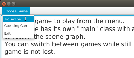
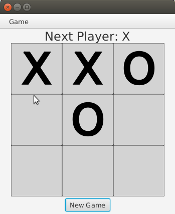

## JavaFX App with Multiple Scenes

You can change the Scene shown in a window (stage).

If you have a reference to the Stage, just do
something like:
```java
Parent root = makeNewScene();
Scene scene2 = new Scene(root);
stage.setScene(scene2);
stage.sizeToScene();
stage.show();
```

But, where in your code do you change the Scene?
If the user performs some action to change the scene, 
the action will be handled in an Event Handler,
which is usually in a controller class.
That controller usually does not have a reference to the stage.

You could fix this in 3 steps:

1. in your application class where the `start(Stage stage)` method is, get a reference to the controller.
2. set a reference to the Stage into the controller.
3. in the controller (event handler), use the Stage to show the new scene when the user requests it

The downside of this is more coupling between objects.  
The Controller or event handler for scene1 needs
to know how to create scene2.  If scene2's controller
also needs to change the scene then it also needs a reference
to the stage and another scene -- more coupling.

## Sample Code

This example shows a solution with low coupling.
Its a simplified version of the *Mediator Design Pattern*.

In this example, the main scene shows:    


when you select a game from the menu, the scene changes:    


In the TicTacToe scene, use the menu to go back to the main scene.
You can come back again and continue playing tic-tac-toe.

Here are the parts:

| Class/Package  | Description        |
|----------------|:-------------------|
| Main           | Main Application class |
| main.fxml      | Simple scene with a menu |
| MainController | Add menu items for the games |
| guessinggame/  | Guesssing Game in JavaFX. This code can run by itself. |
| tictactoe/     | Tic-tac-toe game in JavaFX. This code can run by itself. |
| util/StageManager | Class to manage showing scenes on a single Stage (the Mediator). |

To compile everything into a `bin/` directory:

```
> mkdir bin
> cd src
> javac -d ../bin -cp /path/to/javafx/lib/*:. Main.java
```

To run on command line: 

```
> cd bin
> java --module-path /path/to/javafx/lib --add-modules javafx.fxml,javafx.controls Main
```

### How it Works

`StageManager` is a singleton with a reference to the stage.  It also keeps a reference to scenes and can show any scene on the stage.  In your Application class's `start(Stage stage)` method do this:

```java
class Main extends javafx.application.Application {

    public void start(Stage stage) {
        // Give StageManager a reference to the stage
        StageManager.getInstance().setStage(stage);
```

We also tell stage manager to "remember" the main scene we just created:

```java
        Parent root = ...;   // create the scene graph
        Scene scene = new Scene(root);
        StageManager.getInstance().register("main", scene);
```

Anytime we want to show the "main" scene again, just enter:
```java
    StageManager.getInstance().showScene("main");
```

I added code to StageManager to create some scenes if they are not pre-registered.  That way I don't need to create and register each scene initially (faster start-up):
```java
    // StageManager can create these scenes if not already registered:
    StageManager.getInstance().showScene("guessinggame");
    StageManager.getInstance().showScene("tictactoe");
```

It is not much code -- it just calls each game's own `initComponents()`
method to create the Scene. (A *cooler* solution would be to register a method
reference to create each scene, so that StageManager would not need to know
any details of the application -- just invoke the method reference.)

### Switching to a new game

There are menu items to switch to another scene.
To create a MenuItem for the Tic-tac-toe game, just
define an Event Handler that tells StageManager to show the scene:

```java
    MenuItem item = new MenuItem("Tic-tac-toe");
    // Event Handler as a Lambda expression:
    Handler<ActionEvent> playTicTacToe = (e) -> StageManager.getInstance().showScene("tictactoe");
    // add the event handler
    item.setOnAction( playTicTacToe );
```
Of course, you also have to add the MenuItem to a menu.

### Advantages of a Mediator

A *Mediator* is a go-between for communication between people.
In software, a Mediator handles communication between objects so that
the objects are not coupled to each other. They depend only on the Mediator.

Using a mediator, the Controller for a scene doesn't need a reference
to the Stage, and doesn't need a reference to other scenes.


## Another Approach

There are other ways to "change" the scene without creating a new Scene.

1. **Change Components Within A Layout** - you can remove components from a layout and replace them with new ones.
2. **Use a TabPane** - each tab is a separate container.  
3. **One Controller for Many Scenes**. One controller can create and display many scenes.

All these approaches are simpler.  You have only one controller that knows all the components.  That can simplify passing of information and actions performed by event handlers.
